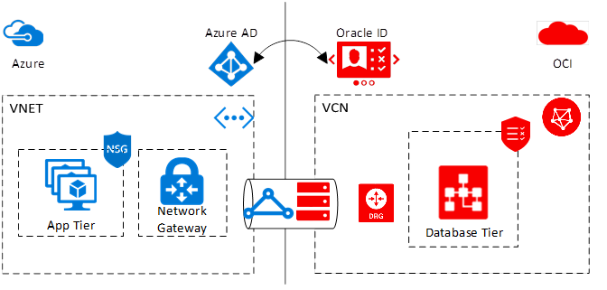
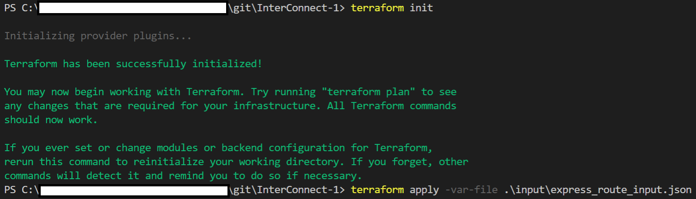
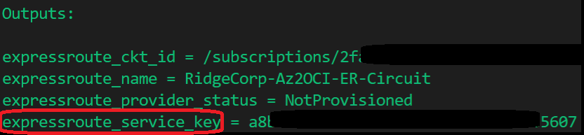

# Introduction

The terraform scripts contained here allow you to deploy the first step of the cross-cloud inter-connect between Microsoft and Oracle Cloud Infrastructure, specifically creating the network connection between Microsoft Azure and OCI.

If you have already established connectivity and are looking for instructions on connecting your VNET and/or VCN to your circuit, please refer to [InterConnect-2](azure-oci-cloud-interconnect/tree/master/InterConnect-2)

# Conceptual Overview

Microsoft and Oracle have partnered together to allow customers to maximize their investments in the two companies by connecting the two clouds together by a high throughput, low latency secure connection. This allows customers to deploy solutions that span these two clouds and take advantage of the best of both worlds.

Microsoft Azure uses ExpressRoute, whereas OCI uses FastConnect to connect at the common edge site without the need for an intermediate service provider. Due to the use of ExpressRoute and FastConnect, customers are able to peer a VNET in Azure with a VCN in OCI as long as the private IP address space does not overlap. Peering the two networks allows one machine in the VNET to communicate to a machine in the OCI VCN as if it were in the same VNET.

The following is a high-level conceptual diagram of the application architecture as split across Microsoft Azure and Oracle Cloud Infrastructure

# Getting Started

## Pre-Requisites

- [An Azure Subscription](https://azure.microsoft.com/en-us/free/)
- [Oracle Cloud Infrastructure Tenancy](https://cloud.oracle.com/en_US/tryit)
- [White-listed for the Azure-OCI Cross-Cloud Capability](<linkTBD>)
- [Terraform Installed on your machine](https://www.terraform.io/downloads.html)

## Instructions

### Setup the Terraform scripts

1. If you haven't already done so in this terminal session, Open the file [env_vars](./../env_vars) (or [env_vars.ps1](./../env_vars.ps1) if you do not have the Windows Sub-system for Linux (WSL) or GitBash installed). Add the details regarding your Azure account. 

1. In order to execute terraform scripts in Azure, you will need to use a Azure AD Service principal and grant it the necessary permissions to create and delete resources in your Azure subscription. You can find more details on achieving this can be found here: [Terraform Azure Provider: Authenticating using a Service Principal with a Client Secret](https://www.terraform.io/docs/providers/azurerm/auth/service_principal_client_secret.html). Alternate options to authenticating with Terraform can also be found in that link. You may need to modify the **provider.tf** file in order to use these alternate ways of authentication.

1. Save the file and close it.

1. Execute the following command from your shell and naviagate to the root folder and execute following command:
    - (For Linux or WSL/GitBash) `$ source env-vars`
    - (For Older versions of Windows) `> env-vars.ps1`

1. The terraform scripts are broken down into two parts. 
    - The first part, which can be found under the folder `InterConnect-1`, setups the Express Route circuit along with private peering on that circuit. Once this terraform scripts completes, an Oracle FastConnect circuit needs to be setup manually at this time using the configurations from the `InterConnect-1` terraform script.
    - The second part can be found under the folder `InterConnect-2` allows you to setup a VNET and a VNET Gateway in Azure, along with a connection to the Express Route circuit. Please note, this terraform script will create everything but the connection of the VNET to the Express Route circuit if the **Provider Status** of the circuit is not set to **Provisioned**.

We will discuss the details of **InterConnect-1** here.

### InterConnect-1: Create an Azure Express Route Circuit

1. Open the [express_route_input.json](./input/express_route_input.json) file and fill in the information as required. Details regarding what information is expected can be found [below](#expressroutecircuit). Save and close the file.

1. From the terminal, navigate to the `InterConnect-1` folder (if you haven't already) and run a terraform init command:
    
    `$ terraform init`

1. You should see the following output:

    

1. Next, run the `terraform apply` command as follows:

    `$ terraform apply -var-file ./input/express_route_input.json`

1. This will create the required Azure resources. You will see the output as follows. Please copy the `expressroute_service_key`. **You will need it to create the OCI FastConnect Circuit**.

    

#### What will this do?

Running through the above instructions will create an ExpressRoute circuit with Oracle Cloud Infrastructure as the provider. In addition, ExpressRoute peering of type 'AzurePrivatePeering' will be setup once your Oracle FastConnect circuit is provisioned (manually). This requires specifying two private IP address spaces of /30 each, which is non overlapping to either your Azure VNET or your OCI VCN. Careful planning must be done to ensure that the address space does not overlap. The IP address space will be used to setup the connection with Oracle Cloud Infrastructure. Two links are setup to ensure a redundant connection between the two clouds. If setting up the inter-connect manually, please refer to the [Interconnect documentation](https://docs.microsoft.com/en-us/azure/virtual-machines/workloads/oracle/configure-azure-oci-networking) for further details.

At the end of provisioning, The ExpressRoute service key will be output, which will be required to setup the Oracle FastConnect circuit.

### Setting up the Oracle FastConnect Circuit & Dynamic Routing Gateway

The Oracle FastConnect & Dynamic Routing Gateway setup hasn't been automated yet. Please refer to the [Oracle documentation](https://docs.cloud.oracle.com/iaas/Content/Network/Concepts/azure.htm) for more details on setting up Oracle FastConnect.

## Next Steps

Once your FastConnect circuit has been provisioned, navigate to the [InterConnect-2](./../InterConnect-2) folder and follow the instructions.

## Deleting/De-provisioning the Interconnect Link

The interconnect cannot be deprovisioned using Terraform. You can follow the manual steps listed below or use the corresponding REST API or SDKs to deprovision the interconnect.

1. Delete the connection between the Virtual Network Gateway and the Express Route circuit in Azure.
1. Delete/deprovision the FastConnect circuit in OCI.
1. Delete/deprovision the ExpressRoute circuit in Azure.

More information on this topic can be found in the [Azure documentation](https://docs.microsoft.com/en-us/azure/virtual-machines/workloads/oracle/configure-azure-oci-networking).

# Terraform Variables

- `resource_group_name`: This is the resource group that you would like to deploy your ExpressRoute circuit in. If you specify a resource group that does not exist, it will be created for you.
- `deployment_location`: The location where the resource group should be created. For a list of all Azure locations, please consult [this link](http://azure.microsoft.com/en-us/regions/) or run `az account list-locations --output table`.
    > **Note**: Please add the region name as shown in the link above. For example, US East region code 'East US'.
- `peering_location`: The name of the peering location and not the Azure resource location.
- `bandwidth_in_mbps`: The bandwidth in Mbps of the ExpressRoute circuit being created. Round down the Mb to the nearest 1000 for Gbps. E.g.: For 1 Gbps connection, enter 1000 Mbps.
- `pvt_peering_primary_subnet`: A /30 subnet for the primary link to OCI. This should be a private IP address space and should not overlap with your Azure VNET space or OCI VCN space. Note this address space down as you will need it while setting up OCI FastConnect.
- `pvt_peering_secondary_subnet`: A /30 subnet for the secondary link to OCI. This should be a private IP address space and should not overlap with your Azure VNET space or OCI VCN space. Note this address space down as you will need it while setting up OCI FastConnect.
- `expressroute_sku`: The ExpressRoute Service tier. Possible values are 'Standard' or 'Premium'
- `expressroute_billing_model`: The ExpressRoute billing model for bandwidth to be used. Possible values are 'UnlimitedData' or 'MeteredData'

# Resources

Azure Terraform Provider Documentation -> [https://www.terraform.io/docs/providers/azurerm](https://www.terraform.io/docs/providers/azurerm)

Azure-Oracle Interconnect Overview -> [https://docs.microsoft.com/en-us/azure/virtual-machines/workloads/oracle/oracle-oci-overview](https://docs.microsoft.com/en-us/azure/virtual-machines/workloads/oracle/oracle-oci-overview)