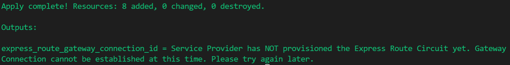

# Introduction

The terraform scripts contained here allow you to deploy the second step of the cross-cloud inter-connect between Microsoft and Oracle Cloud Infrastructure.

If you have not yet established the connectivity between FastConnect and ExpressRoute and are looking for instructions on doing so, please refer to [InterConnect-1](azure-oci-cloud-interconnect/tree/master/InterConnect-1)

Please check your *Express Route Circuit* to ensure that the **Provider Status** is set to **Provisioned** before proceeding with these instructions.

# Conceptual Overview

Microsoft and Oracle have partnered together to allow customers to maximize their investments in the two companies by connecting the two clouds together by a high throughput, low latency secure connection. This allows customers to deploy solutions that span these two clouds and take advantage of the best of both worlds.

Microsoft Azure uses ExpressRoute, whereas OCI uses FastConnect to connect at the common edge site without the need for an intermediate service provider. Due to the use of ExpressRoute and FastConnect, customers are able to peer a VNET in Azure with a VCN in OCI as long as the private IP address space does not overlap. Peering the two networks allows one machine in the VNET to communicate to a machine in the OCI VCN as if it were in the same VNET.

The following is a high-level conceptual diagram of the application architecture as split across Microsoft Azure and Oracle Cloud Infrastructure

# Getting Started

## Pre-Requisites

- [An Azure Subscription](https://azure.microsoft.com/en-us/free/)
- [Oracle Cloud Infrastructure Tenancy](https://cloud.oracle.com/en_US/tryit)
- [White-listed for the Azure-OCI Cross-Cloud Capability](<linkTBD>)
- [Terraform Installed on your machine](https://www.terraform.io/downloads.html)
- [Terraform Modules listed in InterConnect-1](azure-oci-cloud-interconnect/tree/master/InterConnect-1) or [Manual Deployment](https://docs.microsoft.com/en-us/azure/virtual-machines/workloads/oracle/configure-azure-oci-networking#configure-direct-connectivity-between-expressroute-and-fastconnect)

## Instructions

### Setup the Terraform scripts

1. If you haven't already done so in this terminal session, Open the file [env_vars](./../env_vars) (or [env_vars.ps1](./../env_vars.ps1) if you do not have the Windows Sub-system for Linux (WSL) or GitBash installed). Add the details regarding your Azure account.

1. In order to execute terraform scripts in Azure, you will need to use a Azure AD Service principal and grant it the necessary permissions to create and delete resources in your Azure subscription. You can find more details on achieving this can be found here: [Terraform Azure Provider: Authenticating using a Service Principal with a Client Secret](https://www.terraform.io/docs/providers/azurerm/auth/service_principal_client_secret.html). Alternate options to authenticating with Terraform can also be found in that link. You may need to modify the **provider.tf** file in order to use these alternate ways of authentication.

1. Save the file and close it.

1. Execute the following command from your shell and naviagate to the root folder and execute following command:
    - (For Linux or WSL/GitBash) `$ source env-vars`
    - (For Older versions of Windows) `> env-vars.ps1`

1. The terraform scripts are broken down into two parts. 
    - The first part, which can be found under the folder `InterConnect-1`, setups the Express Route circuit along with private peering on that circuit. Once this terraform scripts completes, an Oracle FastConnect circuit needs to be setup manually at this time using the configurations from the `InterConnect-1` terraform script.
    - The second part can be found under the folder `InterConnect-2` allows you to setup a VNET and a VNET Gateway in Azure, along with a connection to the Express Route circuit. Please note, this terraform script will create everything but the connection of the VNET to the Express Route circuit if the **Provider Status** of the circuit is not set to    **Provisioned**.

We will discuss the details of **InterConnect-2** here.

### InterConnect-2: Setup Virtual Network Connectivity

1. Open the [terraform.tfvars](./terraform.tfvars) file and fill in the information as required. Details regarding what information is expected can be found [below](#expressroutecircuit). Save and close the file.

1. From the terminal, navigate to the `InterConnect-2` folder (if you haven't already) and run a terraform init command:
    
    `$ terraform init`

1. Next, run the `terraform apply` command as follows:

    `$ terraform apply`

1. If your Express Route Provider Status is not set to **Provisioned**, you will receive the following output:

    

1. If the Provider Status is not set to **Provisioned**, all the resources except for the VNET to ExpressRoute connection will be created. **You will need to re-run this InterConnect-2 terraform script once the provider status is PROVISIONED in order to setup the connectivity.**

#### What will this do? What resources are created?

Executing the above terraform will create the following resources: 

- Virtual Network (if the VNET you requested doesn't already exist)
- GatewaySubnet in the VNET (if it doesn't already exist)
- Virtual Network Gateway that resides in the GatewaySubnet (if it doesn't already exist)
- VNET Gateway Connection to the Express Route: This will only be created if the Express Route has the *Provider Status* set to **Provisioned**.

An Express Route Gateway will be created in the VNET you're trying to connect to the Express Route circuit (if an Express Route Gateway already exists, it can be re-used). To connect the VNET to the ExpressRoute circuit, a GatewaySubnet (/27 or larger) will be created in the VNET along with a Virtual Network Gateway (Ultra Performance SKU).

### Setting up the Oracle VCN Connectivity & Route Table

The Oracle FastConnect setup hasn't been automated yet. Please refer to the [Oracle documentation](https://docs.cloud.oracle.com/iaas/Content/Network/Concepts/azure.htm) for more details on setting up Virtual Cloud Network and configuring your RouteTable.

## Deleting/De-provisioning the Interconnect Link

The interconnect cannot be deprovisioned using Terraform. You can follow the manual steps listed below or use the corresponding REST API or SDKs to deprovision the interconnect.

1. Delete the connection between the Virtual Network Gateway and the Express Route circuit in Azure.
1. Delete/deprovision the FastConnect circuit in OCI.
1. Delete/deprovision the ExpressRoute circuit in Azure.

More information on this topic can be found in the [Azure documentation](https://docs.microsoft.com/en-us/azure/virtual-machines/workloads/oracle/configure-azure-oci-networking).

# Terraform Variables

- `resource_group_name`: This is the resource group that you would like to deploy your ExpressRoute circuit in. If you specify a resource group that does not exist, it will be created for you.
- `deployment_location`: The location where the resource group should be created. For a list of all Azure locations, please consult [this link](http://azure.microsoft.com/en-us/regions/) or run `az account list-locations --output table`.
    > **Note**: Please add the region name as shown in the link above. For example, US East region code 'East US'.
- `express_route_name`: The name of the Express Route Circuit to be used for the inter-connect. This Express Route circuit must already exist and must have Oracle Cloud Infrastructure as the provider.
- `vnet_name`: The name of the Virtual Network, whether it already exists or needs to be created by Terraform.
- `vnet_cidr`: The IP Address space for your VNET in CIDR notation. Please enter '0' if your VNET exists. If a new VNET is being created, a valid IP Address space must be entered.
- `GatewaySubnet_cidr`: This is the Gateway subnet address space in CIDR notation. If you have an existing 'GatewaySubnet' in your VNET, please enter a '0' and the terraform script will lookup the information needed to find the information for the subnet. It is recommended that your GatewaySubnet have at least a /27 or larger (/27, /26, /25, etc.) for this inter-connect, especially when deploying a 10 Gbps throughput ExpressRoute circuit. Bear in mind, that there can only be 1 GatewaySubnet per VNET. If you are also planning on connecting your on-premises network to Azure using ExpressRoute/VPN, the recommendation is to carve out a GatewaySubnet that would be sufficient to route traffic to on-prem and to OCI. See this [link](https://docs.microsoft.com/en-us/azure/vpn-gateway/vpn-gateway-about-vpn-gateway-settings#requirements) for more details.
- `express_route_gateway_name`: The name of an existing ExpressRoute Gateway. Enter a '0' if you DO NOT have an existing ExpressRoute Gateway setup in your VNET and one will be created for you. The Gateway will be named: '<VNET_Name>-ERGW'.

# Limitations

At this time, only Azure subscriptions and OCI tenancies that are whitelisted will be able to provision the cross-cloud interconnect. Additionally, the Inter-Connect is only available in **East US** region of Microsoft Azure and **Ashburn** region of OCI.

# Resources

Azure Terraform Provider Documentation -> [https://www.terraform.io/docs/providers/azurerm](https://www.terraform.io/docs/providers/azurerm)

Azure-Oracle Interconnect Overview -> [https://docs.microsoft.com/en-us/azure/virtual-machines/workloads/oracle/oracle-oci-overview](https://docs.microsoft.com/en-us/azure/virtual-machines/workloads/oracle/oracle-oci-overview)